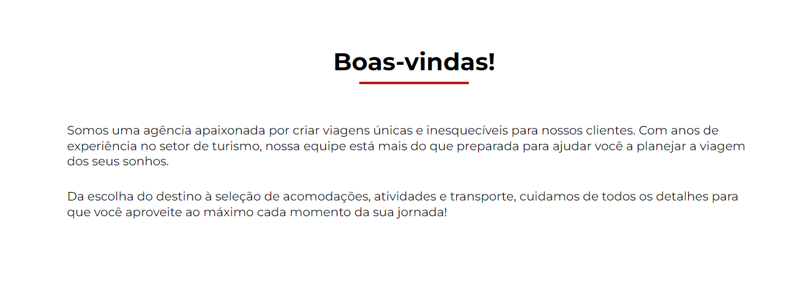
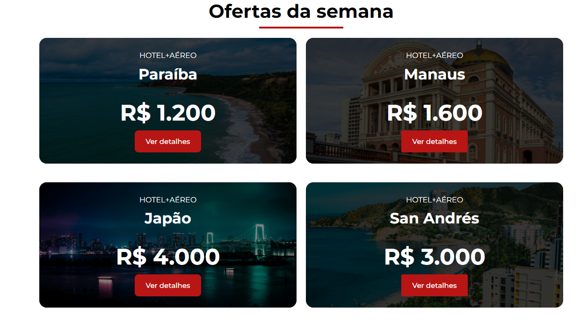
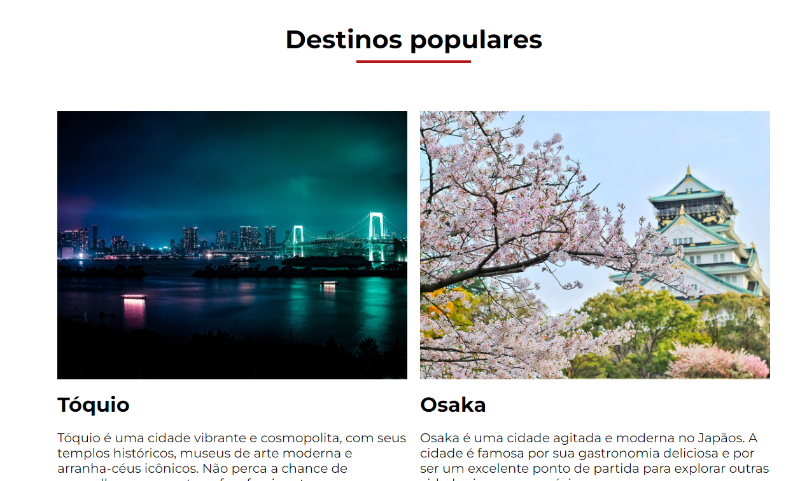

<h1 style="text-align:center">Curso de WordPress com Elementor  Projeto: Jornada Viagens</h1>

O curso abraange de forma clara e dinâmica, como trabalhar com o Elementor através de um projeto criado no Figma, que é um padrão usado na maior parte dos projetos. Durante as aulas, foram ensinadas técnicas para criar as seções de cada parte do site até a sua finalização. Segue alguns tópicos abordados:

<h4>Neste curso, foram ensinadas diversas técnicas e estratégias:</h4>

- Desenvolvendo seções/blocos;
- Criando e editando cabeçalho e rodapé;
- Trabalhando com tipografia;
- Usando o XAMPP para rodar o projeto de maneira local;
- Alinhamentos, espaçamentos internos e externos, configuração do container.

 

<h4 style="text-align:center">Algumas seções do projeto:</h4>

 

 

<h4>Conclusão</h4>

O curso abraange conceitos básicos sobre o Elementor, é algo bem básico e com poucas aulas já é possível desenvolver várias coisas. Senti falta apenas de trabalhar com outras ferramentas avançadas que o Plugin disponibiliza que poderão ser importantes em projetos mais complexos.

Link do [curso](https://cursos.alura.com.br/course/wordpress-crie-sites-elementor-figma) na Alura